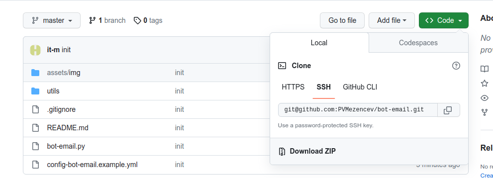
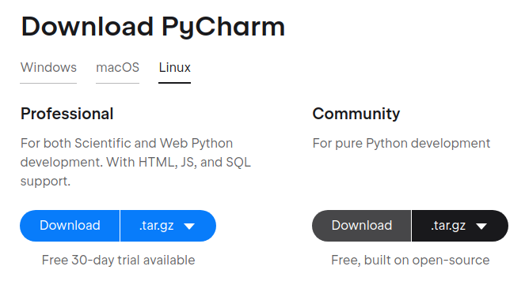
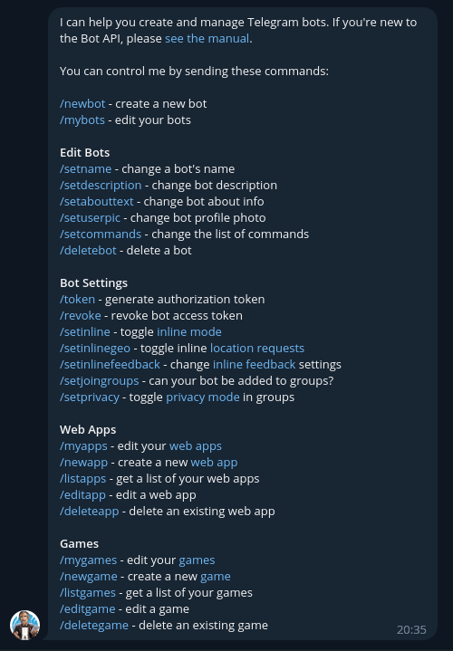
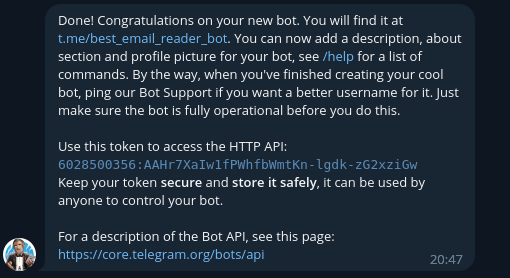

## Aiogram бот для чтения почты.

#### Требования:
```text
python > 3.10
aiogram ~ 2.25.1
```

#### Установка:
1. Если нет возможности использовать git, нужно скачать архив с сайта https://github.com/PVMezencev/bot-email:



2. Скачиваем Pycharm CE (бесплатный Community) по ссылке https://www.jetbrains.com/pycharm/download :



3. Устанавливаем и открываем скачанный проект (предварительно распаковав). Pycharm должен сам определить, каких инструментов и библиотек не хватает и установить их.
4. Файл config-bot-email.example.yml нужно скопировать в той же директории с именем config-bot-email.yml и заполнить конфиг своими данными (см. ниже).

5. Консольный вариант:
```bash
 # Клонируем репозиторий себе инструментами git, либо скачиваем ZIP:
 git clone git@github.com:PVMezencev/bot-email.git && cd bot-email/
 pip install --upgrade pip
 pip install --upgrade aiogram
 pip install --upgrade beautifulsoup4
 pip install --upgrade lxml
 
 # Установить остальные требуемые пакеты.
 
 # Создаем файл конфигурации на основе шаблона, заполняем своими данными.
 cp config-bot-email.example.yml config-bot-email.yml
```

#### Настройки:
* imap - секция настроек сервера IMAP
  * host - `строка` укажите адрес сервера
  * port - `целое число` укажите порт сервера
  * login - `строка` укажите адрес почты
  * password - `строка` укажите пароль от почты (яндекс требует специальный пароль для приложений, тот что от веб - не подходит)
  * inbox - `строка` папка входящей почты (по умолчанию для всех почтовиков папку "Входящие" = INBOX), если папка вложенная (входящие->readable), то нужно указывать от корневой папки "INBOX|readable"
  * archive - `строка` папка для хранения обработанных писем, если указать, то скрипт будет пытаться скопировать письмо в неё
  * read_only - `логический` True или False, если True читаем только те, что ещё не прочитанные, после прочтения отмечаем, как прочитанные. False - читаем все, после прочтения удаляем
* is_cycle - `логический` True или False, если True, то проверка почты запускается в бесконечном цикле, каждые 60 сек, если False, то скрипт завершается после одной попытки проверки. False удобно, если будем запускать скрипт внешним расписанием, например, по крону
* start_bot - `логический` True или False, если True, то запуститься бот и будет отвечать на команды, если False, то будет только пересылать почту
* bot - `строка` укажите токен бота 
* my_telegram_id - `целое число` укажите свой идентификатор телеграм

#### Создание токена для бота:
1. Находим в телеграм через поиск бота-папу - @BotFather
2. Начинаем с ним диалог - нажать "Запустить"
3. Бот ответит полной справкой по своим командам:



4. Отправляем боту команду /newbot - новый бот, бот-папа спросит в ответ, как мы его хотим назвать:


5. Назовём BotEmailReader, особых требований к имени нет, но называйте так, чтоб отражалась суть его задач. Это имя будет отображаться, как имя контакта.
6. Далее бот-папа спрашивает, какую ссылку хотим мы присвоить боту:


7. Тут следует придерживаться шаблона - ссылка должна заканчиваться на "bot". Укажем best_email_reader_bot. Если таких ссылок ещё не присвоено ни одному боту, и шаблон ссылки подходящий, то бот-папа ответит сообщением со всей информацией по боту:



8. Нас интересует токен - вот он `6028500356:AAHr7XaIw1fPWhfbWmtKn-lgdk-zG2xziGw`.
9. Так же, в последствии, у бота-папы можно попросить показать всех своих ботов командой /mybots (к слову, можно создать не более 20 ботов с одного аккаунта, а всевозможные команды бота-папы отображены в меню)
10. Своих ботов можно изменять (все, кроме ссылки): сбрасывать токен, установить аватар, задать набор команд и т.д.. Так же, своего бота можно удалить. (Демонстрационный бот удален)


#### Как узнать свой идентификатор в Телеграм:
1. Этим ботом - запустить его, запросить команду /me.
2. Поискать других чужих ботов, которые покажут ваш идентификатор.
3. Идентификатор реального пользователя - целое положительное число, например 428819662. Идентификатор группы или канала - целое отрицательное число -428819662.
4. Для того, чтоб бот отправлял сообщения в группу - его нужно добавить в группу, для канала - бот должне быть подписан на канал и быть администратором. В файле конфигурации идентификатор нужно указывать как есть.
